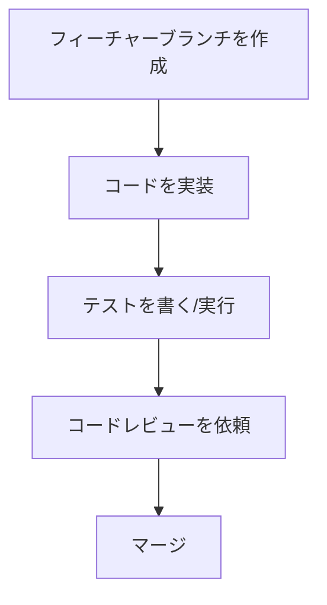

# 開発環境セットアップガイド

このドキュメントでは、AI Process Blueprint プロジェクトの開発環境のセットアップ手順を説明します。

## 前提条件

- Python 3.9以上
- pip またはPoetry（推奨）
- Docker と Docker Compose（オプション、コンテナ開発用）
- Git

## 1. リポジトリのクローン

まず、Gitリポジトリをローカル環境にクローンします。

```bash
git clone https://github.com/yourusername/ai-process-blueprint.git
cd ai-process-blueprint
```

## 2. Python 仮想環境のセットアップ

### 2.1 venv を使う方法

```bash
# 仮想環境を作成
python -m venv .venv

# 仮想環境を有効化
# Windows
.venv\Scripts\activate
# macOS / Linux
source .venv/bin/activate

# 依存関係をインストール
pip install -r requirements.txt
```

### 2.2 Poetry を使う方法（推奨）

```bash
# Poetry がインストールされていない場合
# curl -sSL https://install.python-poetry.org | python3 -

# 依存関係をインストール
poetry install

# 仮想環境を有効化
poetry shell
```

## 3. 環境変数の設定

`.env.example` ファイルをコピーして `.env` ファイルを作成し、必要に応じて設定を変更します。

```bash
cp .env.example .env
# エディタで .env ファイルを編集
```

主要な環境変数：

```
# アプリケーション設定
PORT=8080
DATA_DIR=./data
ENABLE_MCP=true
ENABLE_HTTP=true

# 開発設定
DEBUG=true
LOG_LEVEL=debug
```

## 4. アプリケーションの実行

### 4.1 開発モードでの実行

```bash
# uvicorn を使用してアプリを実行
uvicorn app.main:app --reload --port 8080

# または開発用スクリプトを使用
python run_dev.py
```

### 4.2 Docker を使った実行

```bash
# イメージをビルド
docker build -t ai-process-blueprint .

# コンテナを実行（テンプレートディレクトリをホストとマウント）
docker run -p 8080:8080 -v $(pwd)/templates:/app/templates ai-process-blueprint
```

### 4.3 Docker Compose を使った実行

```bash
# コンテナを起動
docker-compose up -d

# ログを確認
docker-compose logs -f
```

## 5. テストの実行

自動テストを実行してコードの品質を確認します。

```bash
# 全てのテストを実行
pytest

# カバレッジレポートを生成
pytest --cov=app tests/
```

## 6. API ドキュメントの確認

アプリケーションが起動したら、ブラウザで以下のURLにアクセスしてSwagger UIによるAPIドキュメントを確認できます。

```
http://localhost:8080/docs
```

## 7. 開発ワークフロー

### 7.1 新機能の開発

新機能を開発する際は、以下のワークフローに従ってください：



1. 新しいフィーチャーブランチを作成：
   ```bash
   git checkout -b feature/new-feature-name
   ```

2. コードを実装し、テストを書く

3. コードがプロジェクトの基準に合致しているか確認：
   ```bash
   # リンターを実行
   flake8 app tests
   
   # 型チェックを実行
   mypy app
   
   # テストを実行
   pytest
   ```

4. 変更をコミットしてプッシュ：
   ```bash
   git add .
   git commit -m "Add new feature: feature-name"
   git push origin feature/new-feature-name
   ```

5. プルリクエストを作成し、コードレビューを依頼

### 7.2 コードスタイル

このプロジェクトでは以下のコーディング規約を採用しています：

- PEP 8 スタイルガイド
- Google スタイルのドキュメント文字列
- 型ヒントの徹底
- ブラックによるコードフォーマット

コードのフォーマットを自動化するには：

```bash
# コードをフォーマット
black app tests

# インポートを整理
isort app tests
```

## 8. トラブルシューティング

### 8.1 依存関係の問題

依存関係の問題が発生した場合は、以下を試してください：

```bash
# venv を使用している場合
pip install --upgrade -r requirements.txt

# Poetry を使用している場合
poetry update
```

### 8.2 データベース接続の問題

SQLiteデータベースに接続できない場合は、以下を確認してください：

1. `DATA_DIR` 環境変数が正しく設定されているか
2. アプリケーションがディレクトリに書き込み権限を持っているか
3. データベースファイルが破損していないか

必要に応じてデータベースファイルを再作成します：

```bash
rm -f ./data/templates.db
# アプリケーションを再起動すると自動的に再作成されます
```

### 8.3 Docker 関連の問題

Docker 関連の問題が発生した場合は、以下を試してください：

```bash
# コンテナを停止して再ビルド
docker-compose down
docker-compose build --no-cache
docker-compose up -d
```

## 9. 貢献方法

プロジェクトへの貢献を検討される方は、以下の手順に従ってください：

1. イシューを確認し、対応するイシューがない場合は新しいイシューを作成
2. リポジトリをフォークし、フィーチャーブランチを作成
3. 変更を実装し、テストを追加
4. プルリクエストを作成
5. コードレビューを受け、必要に応じて変更を加える
6. 承認されたらマージ

## 10. 開発リソース

- [FastAPI ドキュメント](https://fastapi.tiangolo.com/)
- [FastMCP ドキュメント](https://github.com/ai-forever/fastmcp)
- [SQLAlchemy ドキュメント](https://docs.sqlalchemy.org/)
- [Pydantic ドキュメント](https://pydantic-docs.helpmanual.io/)
- [Pytest ドキュメント](https://docs.pytest.org/)