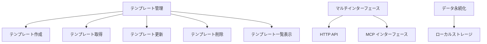
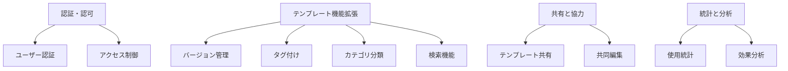
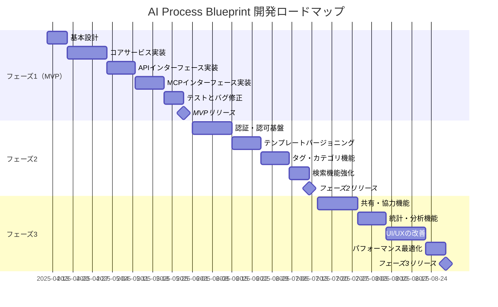

# 製品要求仕様書 (PRD)

## 1. 製品概要

### 1.1 製品ビジョン

AI Process Blueprint は、AIアシスタントに対して明確な作業手順を提供するためのテンプレート管理サービスです。これにより、ユーザーはAIに対して一貫性のある方法で作業を依頼し、予測可能で質の高い結果を得ることができます。

### 1.2 目標と目的

- AIアシスタントが従うべき作業手順のテンプレートを簡単に管理できる
- HTTP APIとMCPの両方のインターフェースを提供し、さまざまなクライアントからアクセス可能にする
- テンプレートの標準化により、AIアシスタントの作業成果の質と一貫性を向上させる
- Markdownベースの柔軟なテンプレート形式により、多様な作業手順を表現可能にする
- 軽量で簡単にデプロイできる設計により、個人から企業まで幅広いユーザーに対応する

### 1.3 ターゲットユーザー

1. **AIアシスタント利用者**
   - 複雑なタスクをAIに依頼する際に、一貫した手順で作業を進めたいユーザー
   - 同じ種類の作業を繰り返しAIに依頼するユーザー
   - チーム内でAI利用の標準化を図りたいマネージャー

2. **AIアシスタント開発者・プロバイダー**
   - AIアシスタントの機能を拡張したいエンジニア
   - ユーザー向けに特化したプロンプトテンプレートを提供したいAIサービス事業者

3. **業務プロセス管理者**
   - 業務プロセスを標準化し、AIに適用したい業務改善担当者
   - チーム内でのAI活用を促進したいナレッジマネージャー

## 2. 製品機能要件

### 2.1 コア機能（MVP段階）



#### 2.1.1 テンプレート管理

| 機能 | 優先度 | 説明 |
|-----|-------|------|
| テンプレート作成 | 必須 | タイトル、内容、説明、作成者を指定して新規テンプレートを登録 |
| テンプレート取得 | 必須 | タイトルを指定して既存のテンプレートを取得 |
| テンプレート更新 | 必須 | 既存テンプレートの内容や説明を更新 |
| テンプレート削除 | 必須 | 指定したテンプレートを削除 |
| テンプレート一覧表示 | 必須 | 登録済みテンプレートの一覧を取得、フィルタリングやページネーション機能を含む |

#### 2.1.2 マルチインターフェース

| 機能 | 優先度 | 説明 |
|-----|-------|------|
| HTTP API | 必須 | RESTful APIとしてテンプレート操作を提供、クライアントアプリケーションからのアクセスを可能に |
| MCP インターフェース | 必須 | Model Context Protocolに準拠したインターフェースを提供し、AIアシスタントが直接テンプレートにアクセス可能に |

#### 2.1.3 データ永続化

| 機能 | 優先度 | 説明 |
|-----|-------|------|
| Markdownファイル保存 | 必須 | テンプレートを個別のMarkdownファイル(.md)として保存 |
| ディレクトリ構造 | 必須 | テンプレートタイトルをファイル名として使用し、整理された構造で保存 |
| メタデータ管理 | 必須 | 各テンプレートのメタデータ(作成者、日時など)をYAMLフロントマターとして管理 |
| Dockerボリュームマウント | 必須 | ホストとコンテナ間でテンプレートディレクトリを同期し、外部編集を可能に |

### 2.2 将来的な拡張機能（MVP以降）



## 3. ユーザーストーリー

### 3.1 基本的なユースケース

1. **テンプレート作成者として**、作業手順テンプレートを登録したい。なぜなら、AIアシスタントに正確な手順で作業してもらいたいからだ。
   - 受け入れ基準:
     - Markdown形式のテンプレートを作成できる
     - タイトル、説明、コンテンツを指定できる
     - 作成したテンプレートがシステムに保存される

2. **AIユーザーとして**、特定のタスクに対応するテンプレートを取得したい。なぜなら、AIアシスタントに指示を出す際の標準的な形式が必要だからだ。
   - 受け入れ基準:
     - タイトルでテンプレートを検索できる
     - テンプレートの全内容を取得できる
     - HTTP APIとMCP経由の両方でアクセスできる

3. **チームリーダーとして**、標準テンプレートを更新したい。なぜなら、プロセスの改善が必要だからだ。
   - 受け入れ基準:
     - 既存テンプレートの内容を変更できる
     - 更新日時が記録される
     - 更新者の情報が記録される

4. **管理者として**、不要になったテンプレートを削除したい。なぜなら、テンプレートリストを整理しておきたいからだ。
   - 受け入れ基準:
     - 指定したテンプレートをシステムから完全に削除できる
     - 削除操作は取り消せない警告がある

5. **ユーザーとして**、利用可能なテンプレート一覧を確認したい。なぜなら、自分のタスクに適したテンプレートを探したいからだ。
   - 受け入れ基準:
     - テンプレートのタイトルと説明の一覧を取得できる
     - 結果を制限してページネーションできる
     - 作成者でフィルタリングできる

### 3.2 AI統合ユースケース

1. **AIアシスタントとして**、指定されたテンプレートを取得したい。なぜなら、ユーザーの指示に従って作業を構造化する必要があるからだ。
   - 受け入れ基準:
     - MCP経由でテンプレートにアクセスできる
     - テンプレートの内容を解釈して作業に適用できる

2. **AIアシスタント開発者として**、新しいテンプレートを登録したい。なぜなら、特定のタスク向けのカスタムテンプレートを提供したいからだ。
   - 受け入れ基準:
     - プログラマティックにテンプレートを作成できる
     - バルクインポート機能がある（将来的な機能）

## 4. 技術要件

### 4.1 アーキテクチャ要件

- **軽量設計**: 最小限のリソースで動作するシンプルなアーキテクチャ
- **コンテナ化**: Docker環境での実行をサポート
- **マイクロサービス互換**: 他のサービスと容易に統合できる設計
- **RESTful設計**: HTTPインターフェースはRESTの原則に従う
- **MCP準拠**: Model Context Protocolの仕様に準拠したインターフェース

### 4.2 性能要件

- レスポンス時間: 通常のリクエストで200ms以内
- スループット: 1秒あたり最低50リクエストを処理可能
- 同時接続: 最低100の同時接続をサポート
- リソース使用: 軽量で最小限のメモリとCPU使用
- スケーラビリティ: 必要に応じて水平スケーリングが可能な設計

### 4.3 セキュリティ要件（将来的）

- 入力検証: すべての入力データを適切に検証
- XSS対策: クロスサイトスクリプティング攻撃からの保護
- CSRF対策: クロスサイトリクエストフォージェリからの保護
- レート制限: 過剰なリクエストを制限する仕組み
- 認証・認可: 将来的なユーザー認証と権限管理の基盤を準備

## 5. MVP定義とロードマップ

### 5.1 MVP（最小実用製品）の範囲

MVP段階では、以下の機能を実装します:

1. **基本的なテンプレート管理**:
   - テンプレートのCRUD操作（作成・読取・更新・削除）
   - テンプレート一覧取得

2. **デュアルインターフェース**:
   - HTTP API (RESTful)
   - MCP (Model Context Protocol)

3. **永続化**:
   - ローカルストレージ（SQLiteまたはファイルシステム）
   - Dockerボリュームによる永続化

4. **基本的なドキュメント**:
   - API仕様書
   - セットアップガイド
   - サンプル使用例

### 5.2 開発フェーズ



### 5.3 優先度マトリックス

```mermaid
quadrantChart
    title 機能優先度マトリックス
    x-axis 実装の複雑さ (低) --> (高)
    y-axis ユーザー価値 (低) --> (高)
    quadrant-1 優先実装 (MVP)
    quadrant-2 次フェーズで計画
    quadrant-3 後日検討
    quadrant-4 簡素化して実装
    "テンプレートCRUD": [0.2, 0.9]
    "テンプレート一覧": [0.1, 0.8]
    "HTTP API": [0.3, 0.9]
    "MCP対応": [0.4, 0.8]
    "ローカルストレージ": [0.2, 0.7]
    "バージョン管理": [0.7, 0.6]
    "ユーザー認証": [0.8, 0.5]
    "タグ付け": [0.5, 0.4]
    "検索機能": [0.6, 0.7]
    "テンプレート共有": [0.7, 0.3]
    "使用統計": [0.8, 0.2]
```

## 6. テスト戦略

### 6.1 テストの種類

- **単体テスト**: 個々のコンポーネントとサービスの機能をテスト
- **統合テスト**: コンポーネント間の相互作用をテスト
- **APIテスト**: HTTPとMCPの両方のインターフェースをテスト
- **パフォーマンステスト**: レスポンス時間とスループットをテスト

### 6.2 テスト戦略の擬似コード

```
FUNCTION テスト戦略(テスト種類)
    // 入力: テストの種類
    // 出力: テスト計画と実行結果
    
    IF テスト種類 = "単体テスト" THEN
        FOR EACH コンポーネント IN システム.すべてのコンポーネント
            テストケース = 生成テストケース(コンポーネント)
            実行テスト(テストケース)
            検証結果(テストケース.結果)
        END FOR
    END IF
    
    IF テスト種類 = "APIテスト" THEN
        FOR EACH エンドポイント IN API.すべてのエンドポイント
            // 正常系テスト
            レスポンス = 呼び出しエンドポイント(エンドポイント, 正常パラメータ)
            検証ステータスコード(レスポンス, 期待値)
            検証レスポンス構造(レスポンス, スキーマ)
            
            // 異常系テスト
            レスポンス = 呼び出しエンドポイント(エンドポイント, 異常パラメータ)
            検証エラー応答(レスポンス)
        END FOR
    END IF
    
    IF テスト種類 = "MCPテスト" THEN
        FOR EACH ツール IN MCP.すべてのツール
            // 正常系テスト
            結果 = 呼び出しツール(ツール, 正常パラメータ)
            検証結果構造(結果, スキーマ)
            
            // 異常系テスト
            結果 = 呼び出しツール(ツール, 異常パラメータ)
            検証エラー応答(結果)
        END FOR
    END IF
    
    テスト報告書 = 生成テスト報告書(すべての結果)
    RETURN テスト報告書
END FUNCTION
```

## 7. 成功指標

### 7.1 技術的指標

- **API応答時間**: 95%のリクエストが200ms以内で応答
- **エラー率**: 99.9%の可用性（エラー率0.1%以下）
- **テストカバレッジ**: コードカバレッジ90%以上
- **リソース使用効率**: メモリ使用量が100MB以下、CPU使用率が10%以下（平常時）

### 7.2 ユーザー関連指標（将来的）

- **アクティブユーザー数**: 月間アクティブユーザー成長率
- **テンプレート数**: システムに登録されたテンプレート数
- **テンプレート使用率**: 登録されたテンプレートの実際の使用回数
- **ユーザー満足度**: フィードバックやアンケート結果

## 8. 前提条件と制約

### 8.1 前提条件

- ユーザーはテンプレートのMarkdown形式に精通している
- AIアシスタントはMCPプロトコルをサポートしている
- 初期段階では認証・認可は不要
- 主に一人または少人数のチームでの使用を想定

### 8.2 制約

- 初期バージョンではローカルストレージのみをサポート
- テンプレートのサイズは100KB以下に制限
- 同時リクエスト数は100までをサポート
- 特定のクラウド環境への依存を避ける

## 9. オープンな質問と決定事項

### 9.1 未解決の質問

- テンプレート変数の標準形式の定義は必要か？
- テンプレートのバージョン管理はどのように実装すべきか？
- 将来的な多言語サポートをどう計画するか？
- AIが複数のテンプレートを組み合わせる機能は必要か？

### 9.2 決定済み事項

- Markdownファイルをテンプレートの保存形式として使用
- ファイルシステムをデータストアとして使用し、Dockerボリュームでホストと同期
- FastAPIとFastMCPを主要フレームワークとして採用
- YAMLフロントマターでテンプレートのメタデータを管理
- Docker環境でのデプロイを前提とした設計

## 10. まとめ

AI Process Blueprint は、AIアシスタントに対して一貫した作業手順を提供するためのテンプレート管理サービスです。HTTP APIとMCPインターフェースの両方をサポートし、軽量で使いやすい設計を目指しています。MVPではテンプレートの基本的なCRUD操作と永続化機能を実装し、将来的にはバージョン管理、検索、