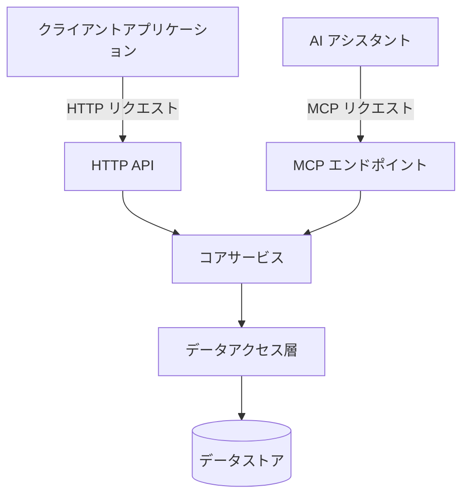
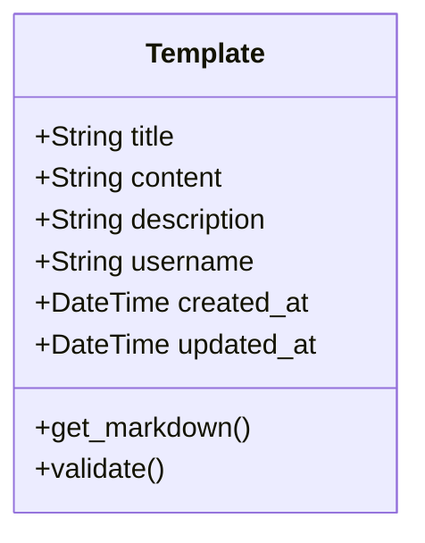
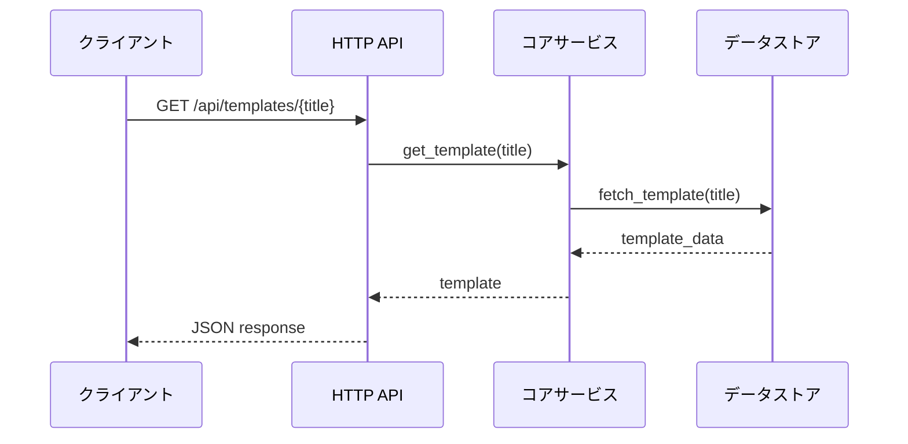
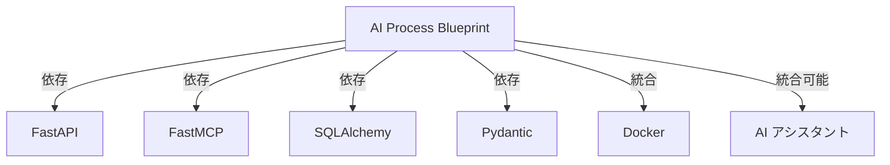

# アーキテクチャドキュメント

このドキュメントでは、AI Process Blueprint サービスのアーキテクチャ設計について詳しく説明します。

## 全体アーキテクチャ



AI Process Blueprint は、効率的で拡張性のあるマルチインターフェースアーキテクチャを採用しています。

## コンポーネント詳細

### 1. インターフェース層

#### 1.1 HTTP API (FastAPI)

RESTful API を提供し、一般的なクライアントアプリケーションからのアクセスを可能にします。

**主要エンドポイント**:
- テンプレート一覧取得 (`GET /api/templates`)
- 単一テンプレート取得 (`GET /api/templates/{title}`)
- テンプレート作成 (`POST /api/templates`)
- テンプレート更新 (`PUT /api/templates/{title}`)
- テンプレート削除 (`DELETE /api/templates/{title}`)

#### 1.2 MCP エンドポイント (FastMCP)

AI アシスタントが直接通信するための Model Context Protocol インターフェースを提供します。

**MCP ツール**:
- `get_template`: テンプレート取得
- `register_template`: テンプレート登録
- `update_template`: テンプレート更新
- `delete_template`: テンプレート削除
- `list_templates`: テンプレート一覧取得

### 2. コアサービス層

ビジネスロジックを実装し、インターフェース層とデータアクセス層を橋渡しします。

**主要コンポーネント**:
- `TemplateService`: テンプレート管理の中核機能
- `ValidationService`: 入力検証とサニタイズ
- `AuthService`: 将来的な認証・認可（MVP外）

### 3. データアクセス層

データの永続化と取得を担当します。

**永続化方式**:
- ファイルシステム: テンプレートをMarkdownファイル(.md)として保存
- ディレクトリ構造: テンプレートタイトルをファイル名として使用
- Dockerボリューム: ホストとコンテナ間でテンプレートディレクトリを同期

## テンプレートモデル



### フィールド説明:
- `title`: テンプレートのタイトル（一意）
- `content`: Markdown形式のテンプレート内容
- `description`: テンプレートの説明・目的
- `username`: 作成者のユーザー名
- `created_at`: 作成日時
- `updated_at`: 更新日時

## フォルダ構造

```
ai-process-blueprint/
├── app/
│   ├── api/                  # FastAPI 実装
│   │   ├── __init__.py
│   │   ├── routes.py
│   │   └── models.py
│   ├── mcp/                  # FastMCP 実装
│   │   ├── __init__.py
│   │   └── tools.py
│   ├── core/                 # コアサービス
│   │   ├── __init__.py
│   │   └── services.py
│   ├── data/                 # データアクセス
│   │   ├── __init__.py
│   │   ├── repository.py
│   │   └── models.py
│   ├── __init__.py
│   └── main.py               # アプリケーションエントリーポイント
├── tests/                    # テスト
├── Dockerfile                # Docker 設定
├── docker-compose.yml        # Docker Compose 設定
├── requirements.txt          # 依存関係
└── README.md                 # プロジェクト概要
```

## 通信フロー



## 技術スタック

- **バックエンド**: Python 3.9+
- **API フレームワーク**: FastAPI
- **MCP フレームワーク**: FastMCP
- **データ永続化**: SQLite / ファイルシステム
- **API ドキュメント**: Swagger UI (OpenAPI)
- **コンテナ化**: Docker
- **依存関係管理**: uv / Pip

## スケーラビリティと拡張性

サービスは初期段階では軽量な実装を採用していますが、将来的な拡張を考慮した設計になっています。

### 将来的な拡張オプション:
- **認証・認可**: OAuth2 / JWT によるユーザー認証
- **テンプレートバージョニング**: 履歴管理と復元機能
- **タグとカテゴリ**: テンプレートの整理と検索機能の強化
- **高度な検索**: 全文検索機能の追加
- **ユーザーフィードバック**: テンプレート評価機能

## パフォーマンス考慮事項

- **キャッシング**: 頻繁に使用されるテンプレートのインメモリキャッシュ
- **データベース最適化**: インデックス適用とクエリ最適化
- **非同期処理**: FastAPI の非同期機能を活用

## 依存関係と統合



## セキュリティ設計

- 入力バリデーションによる注入攻撃の防止
- XSS 対策としての出力エスケープ
- CORS 設定による適切なリソース共有制限
- レート制限によるDDoS対策